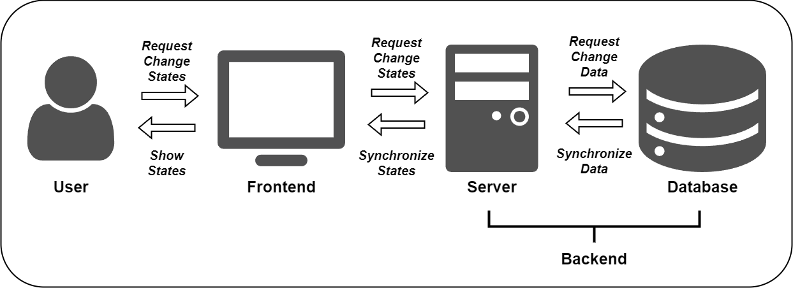
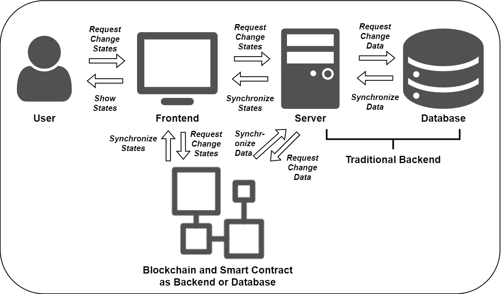

# Core Concepts

## Understanding Web Application Development 

In modern web application development, the frontend and backend have clear divisions of labor. Although technologies are constantly evolving, one thing remains constant: the frontend is responsible for presenting the state, while the backend is responsible for managing the state.

!!! note
    - The recipe focuses on web application development due to zkWasm's strong ties with WebAssembly. However, zkWasm is not limited to web applications, you can use zkWasm to develop applications such as games for other platforms.
    - Wasm's widespread support in web browsers makes it easier to integrate zkWasm into web applications.
    - The zkWasm ecosystem and Delphinus Labs provide web-friendly tools and libraries for a streamlined development process.

### Backend: State Storage and Transformation
The backend is the core of an application, and its main responsibilities include:

1. **State Storage**: The backend stores the application's state data, which can be kept in memory or persisted in a database. Common storage methods include relational databases (like [MySQL](https://www.mysql.com/)) and non-relational databases (like [MongoDB](https://www.mongodb.com/)).

2. **State Transformation**: The backend receives requests from the frontend, transforms the state according to business logic, and returns the new state to the frontend. This process can be seen as a [state machine](https://en.wikipedia.org/wiki/Finite-state_machine), where each request triggers a state transition.

3. **Business Logic**: The backend handles complex business logic, such as user authentication, access control, and data validation, ensuring the legitimacy and security of state transitions.

### Frontend: State Presentation and Interaction
The frontend directly faces the user, and its main responsibilities include:

1. **State Presentation**: The frontend renders the state data returned by the backend into a user interface. Traditional web pages use HTML to describe content structure and CSS to describe appearance. Modern web applications often use JavaScript frameworks (like [React](https://react.dev/) or [Vue](https://vuejs.org/)) to declaratively describe the mapping between UI and state.

2. **User Interaction**: The frontend handles various user interactions, such as mouse clicks, keyboard input, and touch events. When the user performs an action, the frontend updates the UI state and passes the user's intent to the backend.

3. **Local State Management**: Although the backend is the main manager of state, the frontend also needs to manage some local UI states, such as the currently selected tab or whether a modal is shown. These states are usually related to specific UI components and do not need to be passed to the backend.

### Frontend-Backend Separation: State Synchronization

As the division between frontend and backend becomes clearer, frontend-backend separation has become the mainstream model of web development. In this model, the frontend and backend communicate through APIs and need to agree on data formats and communication protocols. We can view the interaction between frontend and backend as a process of synchronizing state from the backend to the frontend: the frontend requests the backend API, the backend returns or updates state data, and the frontend updates the UI based on the state data.

In summary, in a frontend-backend separated architecture, state management requires close cooperation between the frontend and backend. Both sides need to reach agreement on API design, data synchronization, authentication, and other aspects to jointly maintain the application's state.

## Understanding State Management

We've discussed the roles of the frontend and backend in state management. It's clear that regardless of frontend or backend, state management is a core issue in application development. So, what is state? Why is state management so important?

In software development, state is everywhere:

- On the backend, state could be data in a database, objects in memory, files in a filesystem, etc.
- On the frontend, state could be the structure of the DOM tree, CSS styles, JavaScript variables, etc.

Broadly speaking, state is a snapshot of a program at a certain moment. It determines the program's current behavior and future direction. Managing state well means managing the program well.

### State is a "Snapshot" of the System or Application
In computer science, we often say "program = data structure + algorithm". Data structure, in essence, is a representation of the system's state. The system's state at any moment determines its current behavior and properties. Understanding and managing state is the foundation of controlling the system.

Here are a few examples:

- The process management in an operating system is essentially managing the state transitions of processes (ready, running, blocked, etc.).
- Variables in a programming language can be seen as a representation of the program's state. Functional languages emphasize immutable state to reduce the complexity of state management.
- The ACID properties of databases are meant to ensure the consistency of state before and after transactions.

Or more vividly:

- In games, a character's movement, attack, skill release, etc., are all processes of state transition.
- In social networks, a user's state (like follow, like, comment) determines the display of the information flow.
- In e-commerce websites, the state of a user's shopping cart, order status, etc., determines the recommendation system and search results.

The primary task of state management is to choose the right data structure to represent the system's state space. A good state representation should be concise, complete, and easy to verify.

### State Transition Reflects the System's Behavior

If state is a "snapshot" of the system, then state transition is the "script" of the system's behavior. The dynamic behavior of the system can be seen as the result of a series of state transitions. Each input or event may cause a change in state, thereby changing the system's behavior.

The management of state transitions involves several key issues:

1. **Transition Function**: Given the current state and input, how to calculate the next state.
2. **Consistency**: How to ensure the consistency of the final result of concurrent state transitions.
3. **Fault Tolerance**: How to handle invalid state transitions and prevent the system from entering an erroneous state.

For example:

- In a game, a player's attack may cause changes in multiple states, including the attacker's state, the defender's state, the game scene's state, etc.
- In a social network, a user's like may cause changes in multiple states, including the liker's state, the liked person's state, the recommendation system's state, etc.
- On an e-commerce website, a user's cart checkout may cause changes in multiple states, including the shopping cart's state, the order's state, the recommendation system's state, etc.

Many engineering problems, such as concurrency control and exception handling, can essentially be boiled down to the management of state transitions. Good state management should ensure:

1. **State Space**: All possible states are safe and controllable.
2. **State Transition**: Any transition satisfies the predefined constraints.
3. **State Consistency**: All replicas or views eventually converge to a consistent state.

Understanding state management allows us to better understand the essence of blockchain development.

## Understanding Blockchain Engineering

In blockchain application development, the blockchain can replace or partially replace the traditional backend as a distributed database and server. 

The core of blockchain engineering is managing global state in a decentralized network. Here, state can be account balances, smart contract variables, token ownership, etc. Unlike traditional centralized systems, state management in blockchain faces several major challenges.

### Decentralized Storage of Global State

The global state of the blockchain is maintained by all nodes together. Each node saves a complete copy of the state. Although this decentralized storage improves the system's availability and fault tolerance, it also brings several problems:

1. **State Synchronization**: How do newly joined nodes obtain the latest state from other nodes?
2. **State Validation**: How to quickly verify the legitimacy of a state to prevent malicious nodes from injecting erroneous states?
3. **State Storage**: How to design efficient data structures for synchronizing and verifying state among nodes?

For example, Ethereum uses Merkle Patricia Trees to store state, which can quickly verify state consistency and support state queries by light nodes.

### Consensus Mechanism for State Transitions
State transitions in the blockchain are triggered by transactions. But in a decentralized network, reaching consensus on the order and legitimacy of transactions is a very tricky problem. Consensus mechanisms, such as PoW and PoS, provide a way to reach agreement on state transitions among untrusted nodes.

The consensus mechanism needs to solve several problems:

1. **Consistency**: How to ensure that honest nodes see a consistent order of state transitions?
2. **Liveness**: How to ensure that state transitions can be completed within a finite time, without livelock or deadlock?
3. **Incentive**: How to incentivize nodes to participate in consensus and punish malicious behavior?

For example, Bitcoin's PoW reaches consensus through computing power competition, while Ethereum's PoS chooses block-producing nodes through staking and randomness.

### State Management in Smart Contracts

Smart contracts are one of the most powerful features of blockchain. They allow developers to deploy arbitrary state transition logic on the blockchain. From a programming perspective, each contract is like a state machine, managing a set of state variables and performing state transitions based on transaction inputs.

State management in smart contracts involves several key issues:

1. **State Representation**: How to abstract complex business logic and data structures with state variables?
2. **State Transition**: How to ensure that each state transition is deterministic and verifiable?
3. **Concurrency Control**: How to handle concurrent state access and modification to prevent race conditions?

Ethereum's EVM provides a runtime environment for smart contracts. The Solidity programming language supports various state variable types, such as uint, mapping, struct, etc. Contract functions implement state transitions by reading and writing state variables.

### State Extension in Layer2 or Rollup Applications

State storage and transitions in blockchain are all done on Layer1 (mainchain). But due to the limitations of consensus mechanisms and storage capacity, the state throughput of Layer1 is very limited. To extend state capacity, Layer2 solutions emerged.

Layer2 solutions, such as state channels and rollups, process state off-chain and only interact with Layer1 at critical moments (such as final state submission), thus greatly improving state throughput. But this also puts higher requirements on state management:

1. **State Sharding**: How to split state into multiple Layer2s for parallel processing?
2. **Fraud Proofs**: How to use cryptographic methods to prove the legitimacy of off-chain state transitions?
3. **State Submission**: How to securely and efficiently submit Layer2 state to Layer1?

For example, zkRollup uses zero-knowledge proofs to verify off-chain state transitions, while Optimistic Rollup ensures state legitimacy through fraud proofs and challenge periods. zkWasm achieves deterministic and verifiable state transitions by compiling state transition logic into Wasm bytecode and executing it in a zkVM.

## Understanding Zero-Knowledge Proofs

The most significant role of blockchain as a distributed system is verification. We mentioned earlier that zkWasm achieves deterministic and verifiable state transitions, so why do we need verification? What is determinism and verifiability in the context of blockchain, and what role does zero-knowledge proof play in it?

Let's start with the essential properties of blockchain. Blockchain is a decentralized network where each node is equal, and there is no centralized authority. This brings the following problems:

- How to reach consensus among untrusted nodes? 
- How to ensure that the state transitions seen by each node are consistent and correct?

This requires the introduction of a verification mechanism. When accepting a new state transition (such as a transaction or a new block), each node needs to verify its legitimacy. Only state transitions that pass verification can be added to the blockchain and become part of the global consensus.

To achieve reliable verification, determinism and verifiability are needed:

- **Determinism** means that given the same input, the same output is always obtained. In blockchain, determinism means that each node, executing the same state transition logic, will get the same result. This is the premise of reaching consensus. Imagine if the result of a state transition is non-deterministic (for example, dependent on the execution environment or random numbers), different nodes might get different states, breaking the consensus.

- **Verifiability** means that the correctness of a state transition can be efficiently verified. In blockchain, verifiability means that any node can quickly check whether a state transition is legal without redoing all the computations. Imagine if verifying a state transition requires replaying the entire computation process, the cost of verification would be as high as generating the state transition, which is unacceptable in computationally intensive situations.

Traditional blockchains (like Bitcoin and Ethereum) achieve determinism by replaying every transaction on each node, and achieve verifiability through a hash-linked block structure. But this method is less efficient, especially when the state transition logic is complex.

This is where zero-knowledge proofs come into play. Zero-knowledge proofs are a cryptographic technique that can prove a statement is correct without revealing any information. In blockchain, zero-knowledge proofs can be used to prove that a state transition is legal without revealing the specific input data and intermediate states. More Information about Zero-Knowledge Proofs can be found [here](https://en.wikipedia.org/wiki/Zero-knowledge_proof) or Later in Supplemental Resources.

Zero-knowledge proofs provide a more efficient way to implement determinism and verifiability:

- For determinism, zero-knowledge proofs require the state transition logic to be deterministic (like zkWasm using a deterministic Wasm subset) to generate proofs.

- For verifiability, zero-knowledge proofs allow the prover to generate a succinct proof proving the correctness of the state transition, and the verifier only needs to check this proof without redoing the computation. This greatly reduces the cost of verification.

Here's an example. Suppose there is a complex state transition that requires 1,000,000 steps of computation. In a traditional blockchain, each node would need to replay these 1,000,000 steps to verify the result. But with zero-knowledge proofs, the prover only needs to do the computation once to generate a proof, and the verifier might only need to do 100 steps of computation to verify this proof.

In addition to efficiency, zero-knowledge proofs bring another important property: privacy. Since the proving process does not reveal input data and intermediate states, zero-knowledge proofs allow verifying the correctness of a computation result without disclosing the original data. This is very important for privacy-sensitive application scenarios (like finance and healthcare).

### Supplemental Resources

- [Zero-Knowledge Mastery](https://github.com/Quillhash/Zero-Knowledge-Mastery?tab=readme-ov-file): A comprehensive guide to zero-knowledge proofs.
- [zkhack](https://zkhack.dev/): zkhack is a hub for zk learning and building. It hosts virtual events and advanced puzzle competitions, as well as produces educational content and runs study groups. Its goal is to explore and explain key concepts and tools and get you onboarded into zk.
- [zksummit](https://www.zksummit.com/): The annual zkSummit conference, an important event in the zero-knowledge proof community. The conference brings together the best thinkers and builders to discuss the latest in zero knowledge research, zk use-cases, cryptographic primitives, privacy and maths. 
- [progcrypto](https://progcrypto.org/): The Programmable Cryptography Conference is a 2-day event, organized by 0xPARC and PSE, which brings together researchers, developers, and community members focused on next-generation cryptography and its applications. Topics include new research developments in applied cryptography, infrastructure for tools like zkSNARKs and MPC, and applications of these new cryptographic primitives for areas such as digital identity or financial privacy.

Next, we will introduce the core concepts and fundamentals of zkWasm.

