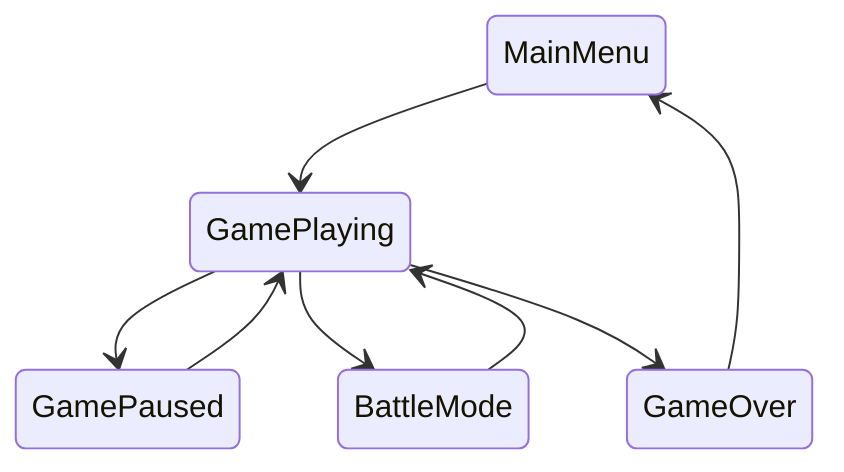
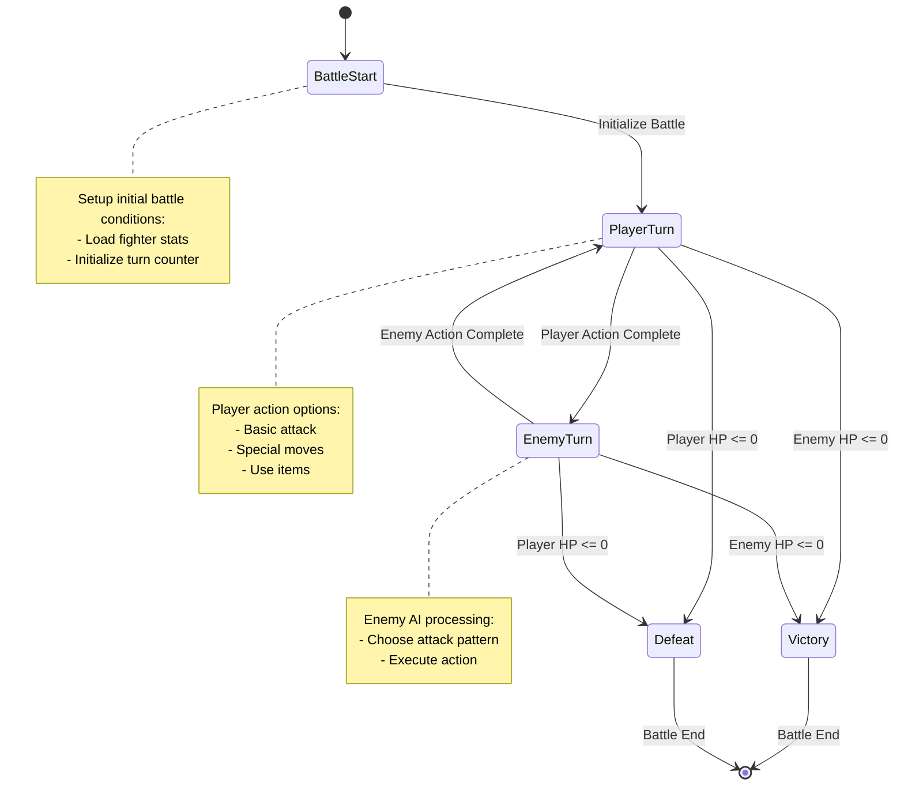

# Designing a Game Application as a State Machine: A Beginner's Guide

## Introduction to State Machines

A state machine is like a flowchart of your game's behavior. Imagine you're creating a simple adventure game - at any moment, your character could be in different situations: exploring, fighting, talking to NPCs, or managing inventory. Each of these situations is a "state", and the rules for moving between them are "transitions".

### Why Use State Machines?

For beginners, state machines offer several advantages:

1. Clear Organization: Your game logic becomes easier to understand and debug
2. Predictable Behavior: You always know exactly what can happen next
3. Easy to Expand: Adding new features becomes more structured
4. Better Testing: Each state can be tested independently

## Understanding Game States Through Examples

### Example 1: A Simple RPG Character

Let's start with a basic character state system:

```rust
// Basic character states
enum CharacterState {
    Idle,
    Walking,
    Running,
    Jumping,
    Attacking,
    TakingDamage,
}

// Character data structure
struct Character {
    state: CharacterState,
    position: Position,
    health: u32,
    stamina: u32,
    inventory: Vec<Item>,
}

// Position in 2D space
struct Position {
    x: f32,
    y: f32,
}

// Game item
struct Item {
    id: u32,
    name: String,
    weight: u32,
}
```

### Example 2: Turn-Based Battle System

Here's how we might structure a turn-based battle system:

```rust
enum BattleState {
    BattleStart,
    PlayerTurn,
    EnemyTurn,
    Victory,
    Defeat,
}

struct BattleSystem {
    current_state: BattleState,
    player: Fighter,
    enemy: Fighter,
    turn_count: u32,
}

struct Fighter {
    health: u32,
    attack: u32,
    defense: u32,
    special_moves: Vec<SpecialMove>,
}
```

## State Transitions: The Heart of Game Logic

### Understanding States

Let's visualize how states flow in a simple game:



Except for the game itself, there are many in-game states that control the game flow. These states are the heart of your game logic, and they determine how your game behaves. Basically, there are two kinds of state you can implement in your game:

1. **Static States**: These states are fixed and cannot be changed. For example, the main menu, game over screen, or game paused state.
2. **Dynamic States**: These states can be changed based on user input or game events. For example, the game playing state, battle mode state, or inventory state.

And those states can be divided into two categories:

1. **Global States**: These states control the flow of the game, such as the main menu, game over screen, or game paused state.
2. **Local States**: These states are related to a specific aspect of the game, such as the game playing state, battle mode state, or inventory state.


### State Flow

Let's visualize how states flow in a turn-based battle system as [example 2](#example-2-turn-based-battle-system):




#### 1. BattleStart
    
   Initial state when combat begins.

!!!info "Entry Actions"
    - Initialize player and enemy Fighter structures
    - Set initial health, attack, and defense values
    - Load special moves into Vec<SpecialMove>
    - Set turn_count to 0


!!!example "Exit Conditions" 
    - Battle initialization complete

!!!tip "Transitions To"
    - PlayerTurn (automatic after initialization)


#### 2. PlayerTurn
Player's action phase.

!!!info "Entry Actions"
    - Increment turn_count
    - Display player options
    - Enable player input

!!!check "Available Actions"
    - Basic attack: damage = player.attack - enemy.defense
    - Special moves: custom effects from special_moves Vec

!!!example "Exit Conditions"
    - Player completes action
    - Health check after action

!!!tip "Transitions To"
    - EnemyTurn (if enemy alive)
    - Victory (if enemy HP <= 0)
    - Defeat (if player HP <= 0)

#### 3. EnemyTurn
Enemy's action phase.

!!!info "Entry Actions"
    - Calculate enemy NPC decision 
    - Display enemy action animation 

!!!check "NPC Algorithm Processing"
    - Choose between basic attack and special moves
    - Target selection (in case of multiple targets)

!!!example "Exit Conditions"
    - Enemy completes action
    - Health check after action

!!!tip "Transitions To"
    - PlayerTurn (if player alive)
    - Victory (if enemy HP <= 0)
    - Defeat (if player HP <= 0)

#### 4. Victory
Battle won state.

!!!info "Entry Actions"
    - Play victory animation
    - Calculate rewards
    - Update player progress

!!!example "Exit Conditions"
    - Victory sequence complete

!!!tip "Transitions To"
    - [End State]

#### 5. Defeat
Battle lost state.

!!!info "Entry Actions"
    - Play defeat animation
    - Save game statistics
    - Prepare retry options

!!!example "Exit Conditions"
    - Defeat sequence complete

!!!tip "Transitions To"
    - [End State]

## Common Patterns and Best Practices

### 1. State Initialization
Always initialize your game with a clear starting state:

```rust
impl GameState {
    fn new() -> Self {
        Self {
            current_scene: SceneType::MainMenu,
            player: Player::new_game(),
            game_time: GameTime::default(),
            battle_state: None,
            dialogue_state: None,
            inventory_state: None,
        }
    }
}
```

### 2. State Validation
Always validate state transitions:

```rust
fn validate_transition(&self, new_state: &GameState) -> Result<(), String> {
    // Check if transition is allowed
    if !self.is_valid_transition(new_state) {
        return Err("Invalid state transition".to_string());
    }
    
    // Validate game rules
    if !self.validate_game_rules(new_state) {
        return Err("Game rules violated".to_string());
    }
    
    Ok(())
}
```

### 3. Error Handling
Use proper error handling for state transitions:

```rust
enum GameError {
    InvalidState(String),
    SaveError(String),
    LoadError(String),
}

type GameResult<T> = Result<T, GameError>;
```

## Debugging and Testing

### 1. State Logging
Implement logging for state transitions use zkWasm SDK:

```rust
fn log_state_transition(&self, old_state: &GameState, new_state: &GameState) {
    zkwasm_rust_sdk::dbg!("State Transition:");
    zkwasm_rust_sdk::dbg!("  From: {:?}", old_state.current_scene);
    zkwasm_rust_sdk::dbg!("  To: {:?}", new_state.current_scene);
    zkwasm_rust_sdk::dbg!("  Player Previous Health: {:?}", 
        old_state.player.health
    );
    zkwasm_rust_sdk::dbg!("  Player Current Health: {:?}", 
        new_state.player.health
    );
}
```

### 2. State Testing
Write tests for your state machine:

```rust
#[cfg(test)]
mod tests {
    use super::*;

    #[test]
    fn test_battle_transition() {
        let mut game = GameState::new();
        game.start_battle(Enemy::new());
        
        assert_eq!(game.current_scene, SceneType::Battle);
        assert!(game.battle_state.is_some());
    }
}
```

You can also test state transitions based on your RPC calls, for example, in the [helloworld rollup](https://github.com/riddles-are-us/helloworld-rollup/blob/main/ts/src/test.ts) we can find a test file which you can modify to test the state transition of the zkWasm Mini Rollup Application:

```ts
import { Player } from "./api.js";
import assert from "assert";
let account = "1234";
let player = new Player(account, "http://localhost:3000");
async function main() {
    let state = await player.getState();
    console.log(state);
    console.log("register");
    await player.register();
    let pre_counter = state.player.data.counter;
    console.log(pre_counter);
    console.log("inc counter");
    state = await player.incCounter();
    let post_counter = state.player.data.counter;
    console.log(post_counter);
    assert(post_counter == pre_counter + 1);
}
main();
```

## Conclusion

Building a game as a state machine makes your code more:

- Organized and easier to understand
- Reliable and predictable
- Testable and debuggable
- Ready for zkWasm integration

Remember to:

1. Start simple and add complexity gradually
2. Keep your states well-defined and documented
3. Implement proper error handling and validation
4. Test each state and transition thoroughly
5. Consider performance implications of state changes

By following these patterns and practices, you'll create a solid foundation for your application that's both maintainable and extensible.